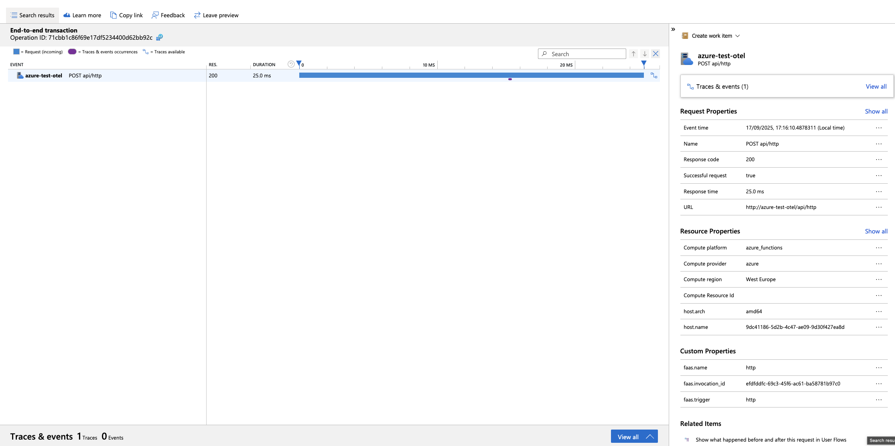
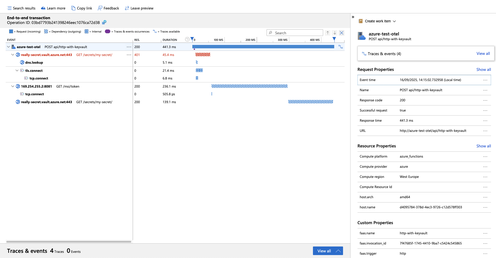
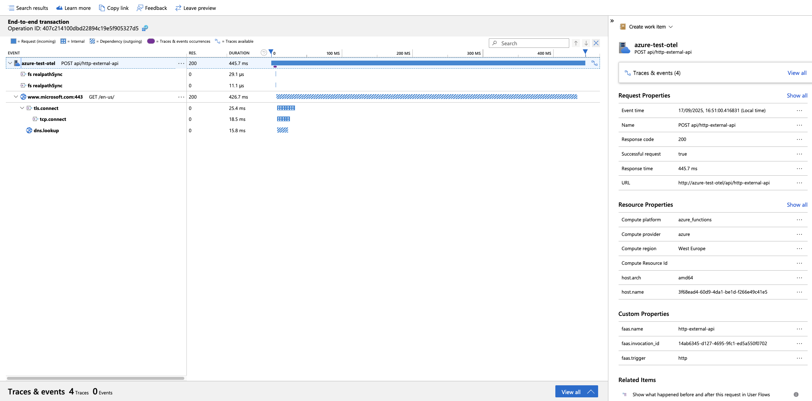

# Experiment

The purpose of the experiment is to test configuration for OTEL support.

Function setup:
- npm
- CommonJS module
- KV Library 4.8

To execute experiment run below script:
```shell
./run.sh
```

## Environment

```text
NODE:
v22.13.1

NPM:
10.9.2

FUNC:
4.2.2

AZ:
{
  "azure-cli": "2.77.0",
  "azure-cli-core": "2.77.0",
  "azure-cli-telemetry": "1.1.0",
  "extensions": {
    "account": "0.2.5",
    "application-insights": "1.2.3",
    "containerapp": "1.2.0b2"
  }
}
```

## Dependencies

```text
@msft-azure-test-functions/otel-cjs-kv4_8@1.0.0 /Users/kamil/repo/ge/msft-azure-test-functions/functions/otel-cjs-kv4_8
├── @azure/functions-opentelemetry-instrumentation@0.2.0 overridden
├── @azure/functions@4.8.0
├── @azure/identity@4.12.0
├── @azure/keyvault-secrets@4.8.0
├── @azure/monitor-opentelemetry-exporter@1.0.0-beta.32
├── @azure/opentelemetry-instrumentation-azure-sdk@1.0.0-beta.9
├── @opentelemetry/api-logs@0.205.0
├── @opentelemetry/api@1.9.0
├── @opentelemetry/instrumentation-dns@0.49.0
├── @opentelemetry/instrumentation-fs@0.25.0
├── @opentelemetry/instrumentation-http@0.205.0
├── @opentelemetry/instrumentation-net@0.49.0
├── @opentelemetry/instrumentation-runtime-node@0.19.0
├── @opentelemetry/instrumentation-undici@0.16.0
├── @opentelemetry/instrumentation@0.205.0
├── @opentelemetry/resource-detector-azure@0.12.0
├── @opentelemetry/resources@2.1.0
├── @opentelemetry/sdk-logs@0.205.0
├── @opentelemetry/sdk-metrics@2.1.0
├── @opentelemetry/sdk-trace-node@2.1.0
├── @types/node@22.18.0
├── axios@1.12.2
├── azure-functions-core-tools@4.2.2
├── rimraf@6.0.1
└── typescript@5.9.2

```
## Package size

```text
Uploading 17.67 MB
```

## Request Timing

| Time | Function | Traceparent | Response (seconds) |
|---|---|---|---|
| Fri Sep 26 13:11:43 BST 2025 | http | 00-6706ae0f39cfd7d3b97aaadbd1a329ba-dbddbd62a4f4ae5f-01
 | 3.785786 |
| Fri Sep 26 13:11:44 BST 2025 | http-with-keyvault | 00-2efc9e5a6b3116466e4e645b083354da-86c70f625c0898ff-01
 | 0.553296 |
| Fri Sep 26 13:11:44 BST 2025 | http-external-api | 00-639b656ff28cbfd4867cecc299ba5f2f-78cdb4381197f3f0-01
 | 0.237874 |

## Trace

## HTTP Trace



## HTTP Key Vault Trace



## HTTP External API Trace



## Observation

