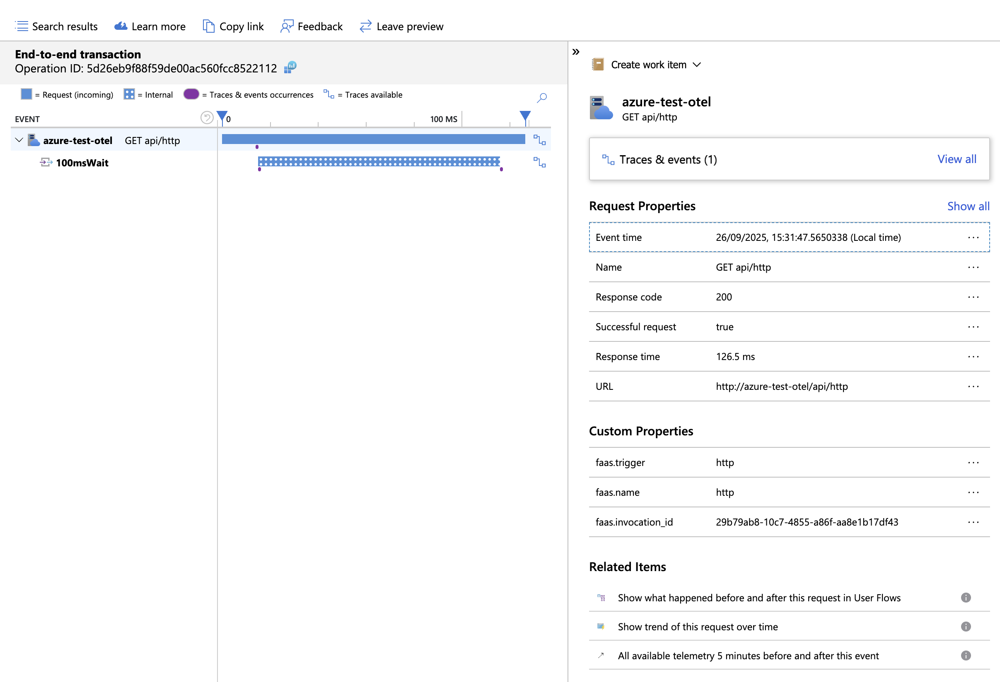
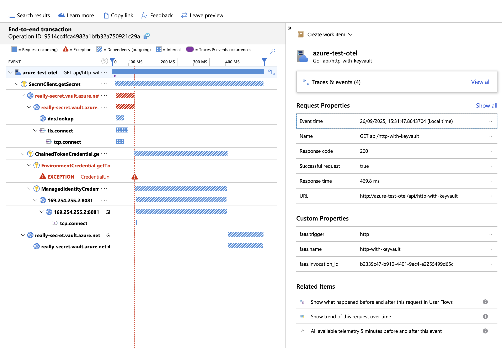

# Experiment

The purpose of the experiment is to test configuration for OTEL support.

Function setup:
- npm
- CommonJS module

To execute experiment run below script:
```shell
./run.sh
```

## Environment

```text
NODE:
v22.13.1

NPM:
10.9.2

FUNC:
4.2.2

AZ:
{
  "azure-cli": "2.77.0",
  "azure-cli-core": "2.77.0",
  "azure-cli-telemetry": "1.1.0",
  "extensions": {
    "account": "0.2.5",
    "application-insights": "1.2.3",
    "containerapp": "1.2.0b2"
  }
}
```

## Dependencies

```text
@msft-azure-test-functions/otel-cjs@1.0.0 /Users/kamil/repo/ge/msft-azure-test-functions/functions/otel-cjs
├── @azure/functions-opentelemetry-instrumentation@0.2.0 overridden
├── @azure/functions@4.8.0
├── @azure/identity@4.12.0
├── @azure/keyvault-secrets@4.10.0
├── @azure/monitor-opentelemetry-exporter@1.0.0-beta.32
├── @opentelemetry/api-logs@0.205.0
├── @opentelemetry/api@1.9.0
├── @opentelemetry/instrumentation-dns@0.49.0
├── @opentelemetry/instrumentation-fs@0.25.0
├── @opentelemetry/instrumentation-http@0.205.0
├── @opentelemetry/instrumentation-net@0.49.0
├── @opentelemetry/instrumentation-runtime-node@0.19.0
├── @opentelemetry/instrumentation-undici@0.16.0
├── @opentelemetry/instrumentation@0.205.0
├── @opentelemetry/resource-detector-azure@0.12.0
├── @opentelemetry/resources@2.1.0
├── @opentelemetry/sdk-logs@0.205.0
├── @opentelemetry/sdk-metrics@2.1.0
├── @opentelemetry/sdk-trace-node@2.1.0
├── @types/node@22.18.0
├── axios@1.12.2
├── azure-functions-core-tools@4.2.2
├── rimraf@6.0.1
└── typescript@5.9.2

```
## Package size

```text
Uploading 17.68 MB
```

## Request Timing

| Function | Traceparent | Response (seconds) |
|---|---|---|
| http | 00-092c77ac960a403991afba09263345cf-eec61d836be40ff4-01
 | 3.658117 |
| http-with-keyvault | 00-db1ee9c365a52182d269506e2c35d946-bb2ba3e9f7f7c6a8-01
 | 0.639281 |
| http-external-api | 00-a212e120b99e5fc25d924a1635a79d50-5251e151a2ead1a5-01
 | 0.829870 |

## Trace

## HTTP Trace



## HTTP Key Vault Trace



## HTTP External API Trace


## Observation

