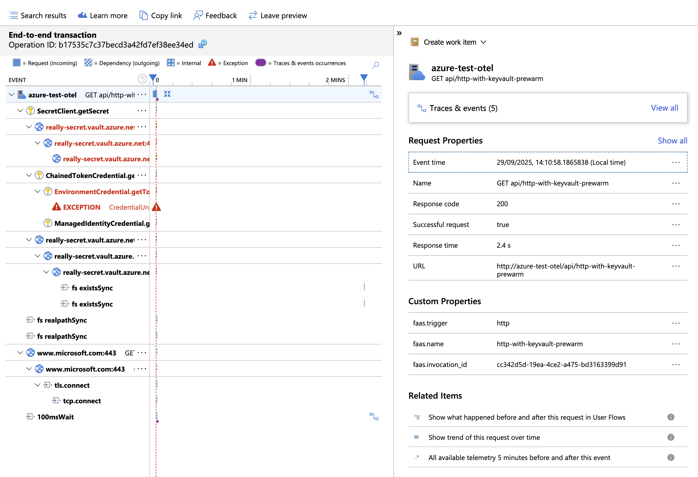
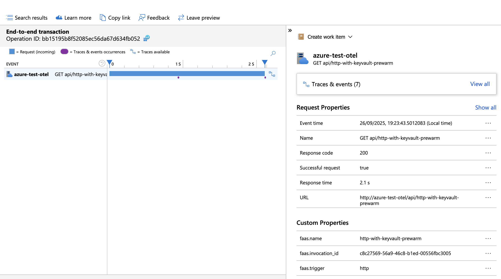
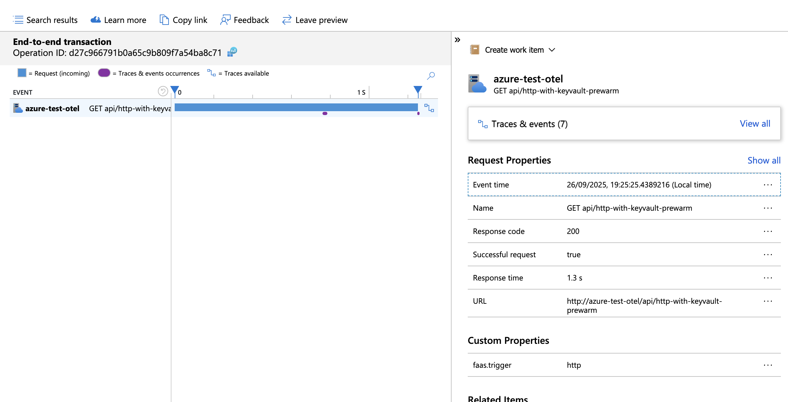
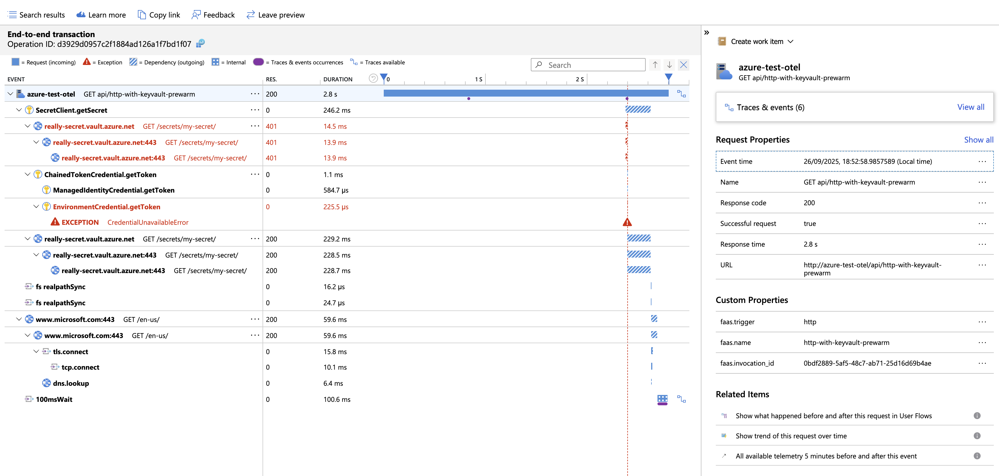
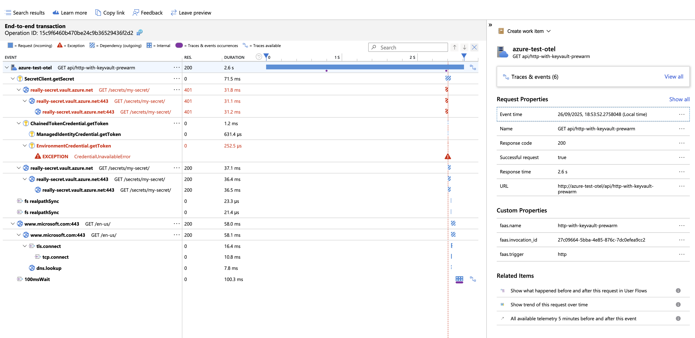

# Experiment

The purpose of the experiment is to test configuration for OTEL support.

Function setup:
- npm
- ESM module
- dynamic import
- esbuild
- KV Library 4.8
- experimental loader
- static import from package.json
- external @azure/functions
- prewarm function
- disable languageWorkers__node__arguments

To execute experiment run below script:
```shell
./run.sh
```

## Environment

```text
NODE:
v22.13.1

NPM:
10.9.2

FUNC:
4.2.2

AZ:
{
  "azure-cli": "2.77.0",
  "azure-cli-core": "2.77.0",
  "azure-cli-telemetry": "1.1.0",
  "extensions": {
    "account": "0.2.5",
    "application-insights": "1.2.3",
    "containerapp": "1.2.0b2"
  }
}
```

## Dependencies

```text
@msft-azure-test-functions/otel-esbuild-esm-static-loader-import-azure-external-azure-function-prewarm-without-node-options@1.0.0 /Users/kamil/repo/ge/msft-azure-test-functions/functions/otel-esbuild-esm-static-loader-import-azure-external-azure-function-prewarm-without-node-options
├── @azure/functions-opentelemetry-instrumentation@0.2.0 overridden
├── @azure/functions@4.8.0
├── @azure/identity@4.12.0
├── @azure/keyvault-secrets@4.10.0
├── @azure/monitor-opentelemetry-exporter@1.0.0-beta.32
├── @azure/opentelemetry-instrumentation-azure-sdk@1.0.0-beta.9
├── @opentelemetry/api-logs@0.205.0
├── @opentelemetry/api@1.9.0
├── @opentelemetry/instrumentation-dns@0.49.0
├── @opentelemetry/instrumentation-fs@0.25.0
├── @opentelemetry/instrumentation-http@0.205.0
├── @opentelemetry/instrumentation-net@0.49.0
├── @opentelemetry/instrumentation-runtime-node@0.19.0
├── @opentelemetry/instrumentation-undici@0.16.0
├── @opentelemetry/instrumentation@0.205.0
├── @opentelemetry/resource-detector-azure@0.12.0
├── @opentelemetry/resources@2.1.0
├── @opentelemetry/sdk-logs@0.205.0
├── @opentelemetry/sdk-metrics@2.1.0
├── @opentelemetry/sdk-trace-node@2.1.0
├── @types/node@22.18.0
├── axios@1.12.2
├── azure-functions-core-tools@4.2.2
├── esbuild@0.25.1
├── rimraf@6.0.1
├── source-map-support@0.5.21
└── typescript@5.9.2

```
## Package size

```text
Uploading 10.77 MB
```

## Request Timing

| Time | Function | Traceparent | Response (seconds) |
|---|---|---|---|
| Fri Sep 26 16:20:48 BST 2025 | http-with-keyvault-prewarm | 00-cde1080fc8717230f82363c5dd900067-04655277114b036c-01
 | 0.570180 |

## Trace

## Full Trace



## Pre-warm up Trace


## Logs

[Logs](assets/logs.csv)

## Observation

### How to Run

This setup disables NODE_OPTIONS and uses scripts to configure source maps and OpenTelemetry.

Unfortunately, using register doesn't resolve the issue with OpenTelemetry, we still see empty traces, as shown in the attached screenshots.

How to Run

1. Open two terminal windows.
2. the first window, start the `./request.sh` script in a loop:

```shell
 while 1; do; ./request.sh; done 
```

This will sequentially trigger requests to the service.

3.	In the second window, start the deployment using the `./deploy.sh` script.

Observations:

- While running the scripts, we observed two "cold starts".
- The slower request takes just under 4 seconds (see attached [file for details](./assets/2025-09-25_request.log)).
- There are two types of requests recorded.
- There is a significant discrepancy between:
    - What the trace reports.
    - The actual request duration measured.
    - There is different around `500ms` between `languageWorkers__node_arguments` enabled and disabled

### languageWorkers__node__arguments disabled

CURL report:

```text
Fri Sep 26 19:23:45 BST 2025 | http-with-keyvault-prewarm | 00-bb15195b8f52085ec56da67d634fb052-ba64e5a977f7cef9-01
 | 3.999714 |
Fri Sep 26 19:25:27 BST 2025 | http-with-keyvault-prewarm | 00-d27c966791b0a65c9b809f7a54ba8c71-39ca768a28cb98e7-01
 | 3.676372 |
```

Trace report:





### languageWorkers__node__arguments enabled

CURL report:

```text
Fri Sep 26 18:53:01 BST 2025 | http-with-keyvault-prewarm | 00-d3929d0957c2f1884ad126a1f7bd1f07-c90fcac6e20d982c-01 | 4.623443 |
Fri Sep 26 18:53:54 BST 2025 | http-with-keyvault-prewarm | 00-15c9f6460b470be24c9b36529436f2d2-a51c0ce94c732e0a-01 | 4.105388 |
```

Trace report:




