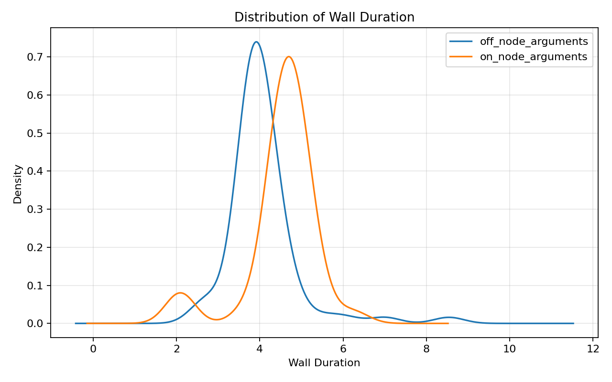
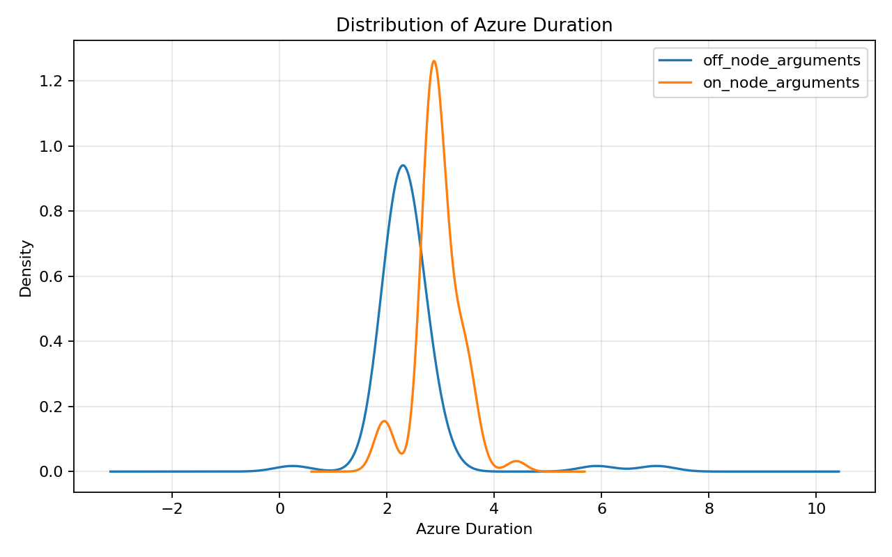
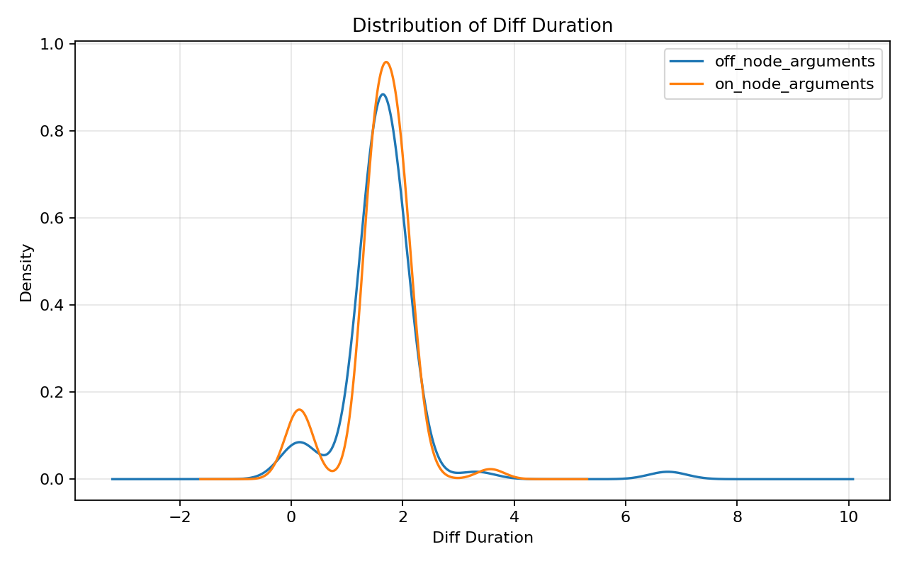

# Request Time Analysis

## Overview

A total of 69 samples were collected for each case, covering a 1 hour 30 minute period. The samples were gathered during a continuous deployment while a sequential request repeatedly hit the service throughout the deployment which either represent a cold start of scalling out.

See [deploy.sh](../deploy.sh) and [request.sh](../request.sh) for details.

## Data Generation

Filter requests longer than 2 seconds:

```shell
filter.sh
```

Create markdown datasets with Azure Duration added:

```shell
node azure-analytics.js filtered/requests-node-arguments-off.log filtered/requests-node-arguments-off.md
node azure-analytics.js filtered/requests-node-arguments-on.log filtered/requests-node-arguments-on.md
```

Generate statistical data:

```shell
python3 -m venv .venv
source .venv/bin/activate
pip install -r requirements.txt

./analyze_azure_function_requests.py --off-md filtered/requests-node-arguments-off.md --on-md filtered/requests-node-arguments-on.md --plots assets --out-md analysis.md

```

Generate PDF file:

```shell
pandoc README.md -o README.pdf
```


## Datasets

- **on_node_arguments**: requests where `languageWorker_arguments_node` is **present**.
- **off_node_arguments**: requests where `languageWorker_arguments_node` is **absent**.

Each dataset includes:

- **Date and Time**: execution date
- **Trace Id** – OpenTelemetry trace identifier  
- **Wall Duration** – end-to-end time measured by `curl` (client-side)  
- **Azure Duration** – execution time reported by Azure metrics (server-side)  
- **Diff Duration**: `Wall Duration - Azure Duration` (approximate overhead outside function execution: network, cold start gaps, platform, etc.).

## Summary Statistics

### Wall Duration (seconds)




| group             |   count |   mean |   std |   min |   p50 |   p95 |   p99 |   max |
|:------------------|--------:|-------:|------:|------:|------:|------:|------:|------:|
| off_node_arguments   |      69 |  4.074 | 0.845 | 2.567 | 3.919 | 5.246 | 7.49  | 8.539 |
| on_node_arguments |      69 |  4.547 | 0.823 | 2.021 | 4.704 | 5.399 | 6.197 | 6.353 |


### Azure Duration (seconds)




| group             |   count |   mean |   std |   min |   p50 |   p95 |   p99 |   max |
|:------------------|--------:|-------:|------:|------:|------:|------:|------:|------:|
| off_node_arguments   |      69 |  2.421 | 0.787 | 0.24  | 2.316 | 2.862 | 6.265 | 7.027 |
| on_node_arguments |      69 |  2.954 | 0.419 | 1.865 | 2.898 | 3.531 | 3.921 | 4.41  |


### Diff Duration (seconds)




| group             |   count |   mean |   std |   min |   p50 |   p95 |   p99 |   max |
|:------------------|--------:|-------:|------:|------:|------:|------:|------:|------:|
| off_node_arguments   |      69 |  1.653 | 0.794 | 0.112 | 1.554 | 2.049 | 4.415 | 6.757 |
| on_node_arguments |      69 |  1.593 | 0.584 | 0.103 | 1.637 | 2.1   | 2.746 | 3.573 |


### Initialisation time

#### off_node_arguments 

```kql
dependencies
| where timestamp > todatetime('2025-09-30 12:19') and timestamp < todatetime('2025-09-30 13:46')
| where target ==  "prewarm-with-node-options"
| summarize count(), max(duration), min(duration), avg(duration), percentiles(duration, 50, 95, 99)
```


| count_ | max_duration | min_duration | avg_duration | percentile_duration_50 | percentile_duration_95 | percentile_duration_99 |
| --- | --- | --- | --- | --- | --- | --- |
| 24 | 844.7586 | 218.0278 | 519.7196375 | 557.1087 | 765.464 | 844.7586 |


#### on_node_arguments 

```kql
dependencies
| where timestamp > todatetime('2025-10-01 09:15') and timestamp < todatetime('2025-10-01 10:41')
| where target ==  "prewarm-with-node-options"
| summarize count(), max(duration), min(duration), avg(duration), percentiles(duration, 50, 95, 99)
```


| count_ | max_duration | min_duration | avg_duration | percentile_duration_50 | percentile_duration_95 | percentile_duration_99 |
| --- | --- | --- | --- | --- | --- | --- |
| 64 | 431.337 | 133.3171 | 223.039895| 212.6605 | 330.7835 | 431.337| 


## Key Observations

1. **Performance Difference**
   - On average, **off_node_arguments** is about **12% faster** (4.07 vs 4.55 mean).  
   - Median values also confirm this trend (3.92 vs 4.70).  

2. **Stability**
   - Both cases show similar variability (std ~0.82–0.85).
   - **off_node_arguments** shows higher extreme spikes (max 8.54 vs 6.35).  

3. **High Percentiles**
   - At **p95**, both are similar (~5.3–5.4).
   - At **p99**, *off_node_arguments* performs worse (7.49 vs 6.20), indicating occasional high-latency outliers.  

4. **Distribution**
   - **on_node_arguments**: more consistent, clustered around ~4.5–5.0.  
   - **off_node_arguments**: generally faster but with a longer tail (rare spikes).  

## Conclusion

- Running the function without `languageWorker_node_arguments` (off_node_arguments) results in lower average latency but introduces occasional severe spikes in response times.
- The performance impact of having `languageWorker_node_arguments` enabled (on_node_arguments) is approximately:
    - ~**+500ms** at mean
    - ~**+800ms** at p50
    - ~**-1s**  at p95
    - ~**-1.3s** s at p99
- Functions with `languageWorker_node_arguments` enabled (on_node_arguments) are slightly slower overall but demonstrate more predictable and stable performance.
- Azure Duration vs Wall Duration - The execution time reported by Azure is consistently shorter than the wall duration, leaving an unexplained delay of nearly 2 seconds at p95.
- Initialization Duration - The initial request (which invokes Key Vault on the first function start) takes longer when `languageWorker_node_arguments` are not present (off_node_arguments).
- Request Duration - The HTTP request itself takes approximately **300ms**.
- Function Execution Time - Combining Initialization Duration and Request Duration, the total execution time shows roughly **~1s** of unaccounted latency during cold starts - time not visible in traces.
    - For example, at `p50`, the Azure Duration is around *1.5s*.
    - Within this, the actual request execution is **~0.3s**, and initialization contributes approximately **0.5–0.2s**.
- Instrumentation - Instrumentation (which captures traces and makes them visible in Application Insights) does not fully function when `languageWorker_node_arguments` are disabled (off_node_arguments).
    - For example, DNS operations are not being captured.
