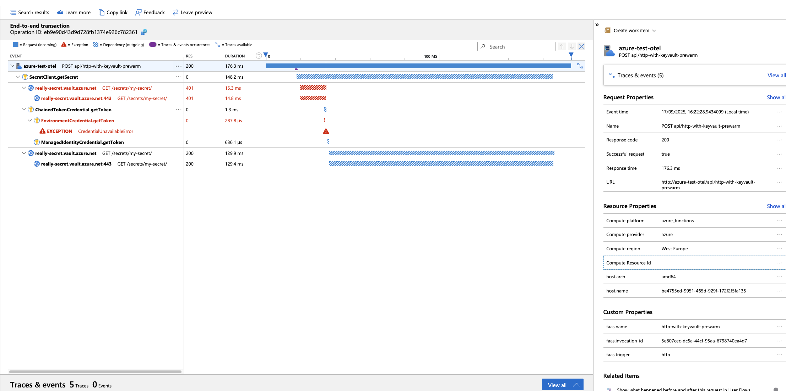
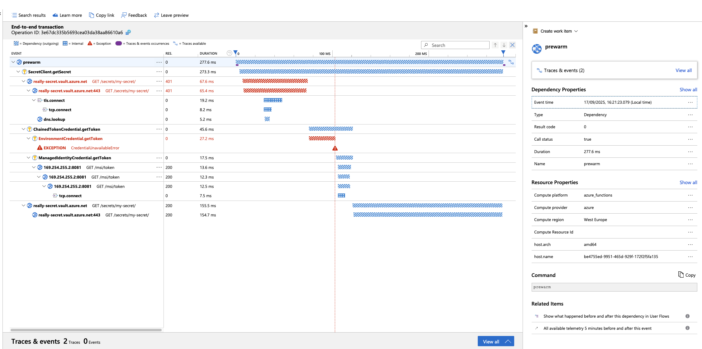

# Experiment

The purpose of the experiment is to test configuration for OTEL support.

Function setup:
- npm
- ESM module
- esbuild
- experimental loader
- import

To execute experiment run below script:
```shell
./run.sh
```

## Environment

```text
NODE:
v22.13.1

NPM:
10.9.2

FUNC:
4.0.6821

AZ:
{
  "azure-cli": "2.75.0",
  "azure-cli-core": "2.75.0",
  "azure-cli-telemetry": "1.1.0",
  "extensions": {
    "account": "0.2.5",
    "application-insights": "1.2.3",
    "containerapp": "1.2.0b2"
  }
}
```

## Dependencies

```text
@msft-azure-test-functions/otel-esbuild-esm-static-loader-import@1.0.0 /Users/kamil/repo/ge/msft-azure-test-functions/functions/otel-esbuild-esm-static-loader-import-azure-external-azure-function-prewarm
├── @azure/functions-opentelemetry-instrumentation@0.2.0 overridden
├── @azure/functions@4.7.2
├── @azure/identity@4.11.1
├── @azure/keyvault-secrets@4.10.0
├── @azure/monitor-opentelemetry-exporter@1.0.0-beta.32
├── @azure/opentelemetry-instrumentation-azure-sdk@1.0.0-beta.9
├── @opentelemetry/api-logs@0.203.0
├── @opentelemetry/api@1.9.0
├── @opentelemetry/instrumentation-dns@0.47.0
├── @opentelemetry/instrumentation-fs@0.23.0
├── @opentelemetry/instrumentation-http@0.203.0
├── @opentelemetry/instrumentation-net@0.47.0
├── @opentelemetry/instrumentation-runtime-node@0.17.1
├── @opentelemetry/instrumentation-undici@0.14.0
├── @opentelemetry/instrumentation@0.203.0
├── @opentelemetry/resource-detector-azure@0.10.0
├── @opentelemetry/resources@2.0.1
├── @opentelemetry/sdk-logs@0.203.0
├── @opentelemetry/sdk-metrics@2.0.1
├── @opentelemetry/sdk-trace-node@2.0.1
├── @types/node@22.18.0
├── axios@1.11.0
├── azure-functions-core-tools@4.2.2
├── esbuild@0.25.1
├── rimraf@6.0.1
└── typescript@5.9.2

```
## Package size

```text
Uploading 10.19 MB [##############################################################################]
```

## Request Timing

| Function | Response (seconds) |
|---|---|
| http-with-keyvault-prewarm | 4.414055 |

## Trace

### Full Trace



### Prewarm-up Trace



## Logs

[Logs](assets/logs.csv)

## Observation

- We see the line  `12/09/2025, 10:50:57.152 Secret loaded Local secret[object Object] 405.67163200000005`  occurring **before the OTEL event** — why?  

- **Cold start observations**:  
  - Total time: `2.5 seconds`  
  - `OTEL initialisation`: `21ms`  
  - `Prewarm-up`: `237ms`  
  - `Function execution`: `142ms`  
  - What is taking the remaining **~2 seconds**?  

- `Prewarm-up` and `Function execution` are **not linked**, leaving a gap in the trace
