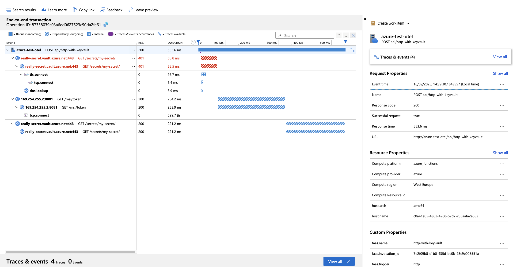
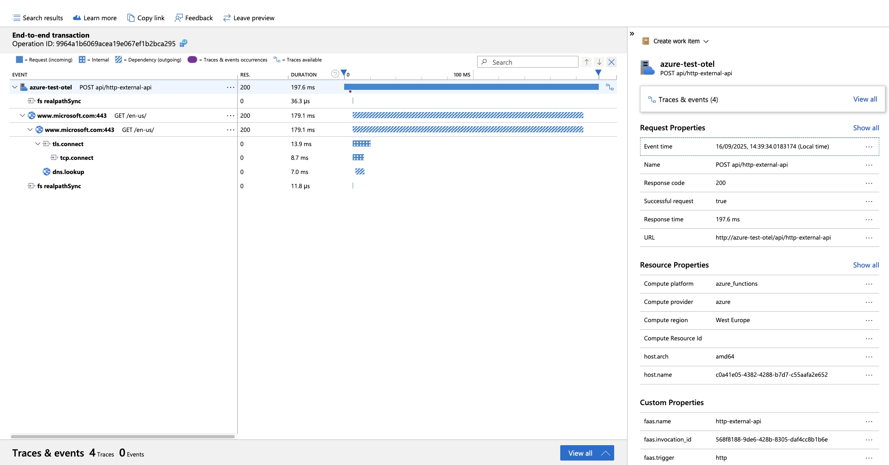

# Experiment

The purpose of the experiment is to test configuration for OTEL support.

Function setup:
- npm
- ESM module
- @azure/keyvault-secrets@4.8.0

To execute experiment run below script:
```shell
./run.sh
```

## Environment

```text
NODE:
v22.13.1

NPM:
10.9.2

FUNC:
4.0.6821

AZ:
{
  "azure-cli": "2.75.0",
  "azure-cli-core": "2.75.0",
  "azure-cli-telemetry": "1.1.0",
  "extensions": {
    "account": "0.2.5",
    "application-insights": "1.2.3",
    "containerapp": "1.2.0b2"
  }
}
```

## Dependencies

```text
@azure-test/otel-esm@1.0.0 /Users/kamil/repo/ge/azure-test/functions/otel-esm-kv4_8
├── @azure/functions-opentelemetry-instrumentation@0.2.0 overridden
├── @azure/functions@4.7.2
├── @azure/identity@4.11.1
├── @azure/keyvault-secrets@4.10.0
├── @azure/monitor-opentelemetry-exporter@1.0.0-beta.32
├── @opentelemetry/api-logs@0.203.0
├── @opentelemetry/api@1.9.0
├── @opentelemetry/auto-configuration-propagators@0.4.2
├── @opentelemetry/auto-instrumentations-node@0.62.2
├── @opentelemetry/instrumentation-dns@0.47.0
├── @opentelemetry/instrumentation-fs@0.23.0
├── @opentelemetry/instrumentation-http@0.203.0
├── @opentelemetry/instrumentation-net@0.47.0
├── @opentelemetry/instrumentation-runtime-node@0.17.1
├── @opentelemetry/instrumentation-undici@0.14.0
├── @opentelemetry/instrumentation@0.203.0
├── @opentelemetry/resource-detector-azure@0.10.0
├── @opentelemetry/resources@2.0.1
├── @opentelemetry/sdk-logs@0.203.0
├── @opentelemetry/sdk-metrics@2.0.1
├── @opentelemetry/sdk-trace-node@2.0.1
├── @types/node@22.18.0
├── axios@1.11.0
├── azure-functions-core-tools@4.2.2
├── rimraf@6.0.1
└── typescript@5.9.2

```
## Package size

```text
Uploading 23.92 MB [##############################################################################]
```

## Request Timing

| Function | Response (seconds) |
|---|---|
| http | 0.171575 |
| http-with-keyvault | 0.642918 |
| http-external-api | 1.895133 |

## Trace

## HTTP Trace


## HTTP Key Vault Trace



## HTTP External API Trace



## Observation

- Initial request was really quick compared to previous runs.
- Duplicate HTTP traces for external api compared to CommonJS modules.

