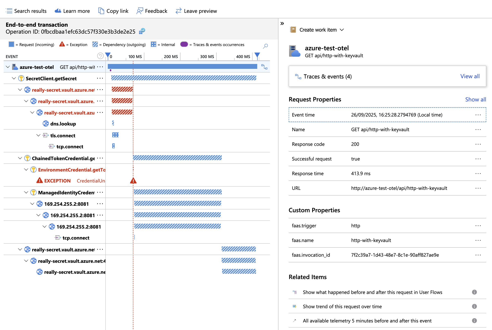
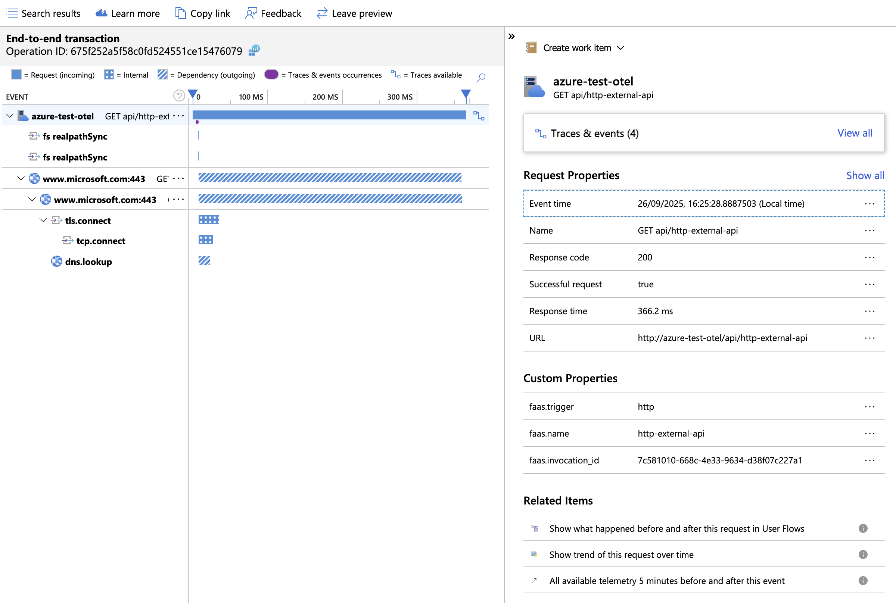

# Experiment

The purpose of the experiment is to test configuration for OTEL support.

Function setup:
- npm
- ESM module

To execute experiment run below script:
```shell
./run.sh
```

## Environment

```text
NODE:
v24.7.0

NPM:
11.5.1

FUNC:
4.2.2

AZ:
{
  "azure-cli": "2.77.0",
  "azure-cli-core": "2.77.0",
  "azure-cli-telemetry": "1.1.0",
  "extensions": {}
}
```

## Dependencies

```text
@msft-azure-test-functions/otel-esm@1.0.0 /Users/potter/repos/msft-azure-test-functions/functions/otel-esm
├── @azure/functions-opentelemetry-instrumentation@0.2.0
├── @azure/functions@4.8.0
├── @azure/identity@4.12.0
├── @azure/keyvault-secrets@4.10.0
├── @azure/monitor-opentelemetry-exporter@1.0.0-beta.32
├── @opentelemetry/api-logs@0.205.0 overridden
├── @opentelemetry/api@1.9.0
├── @opentelemetry/auto-configuration-propagators@0.4.2
├── @opentelemetry/auto-instrumentations-node@0.64.1
├── @opentelemetry/instrumentation-dns@0.49.0
├── @opentelemetry/instrumentation-fs@0.25.0
├── @opentelemetry/instrumentation-http@0.205.0
├── @opentelemetry/instrumentation-net@0.49.0
├── @opentelemetry/instrumentation-runtime-node@0.19.0
├── @opentelemetry/instrumentation-undici@0.16.0
├── @opentelemetry/instrumentation@0.205.0 overridden
├── @opentelemetry/resource-detector-azure@0.12.0
├── @opentelemetry/resources@2.1.0
├── @opentelemetry/sdk-logs@0.205.0
├── @opentelemetry/sdk-metrics@2.1.0
├── @opentelemetry/sdk-trace-node@2.1.0
├── @types/node@22.18.0
├── axios@1.12.2
├── azure-functions-core-tools@4.2.2
├── rimraf@6.0.1
└── typescript@5.9.2

```
## Package size

```text
Uploading 22.7 MB
```

## Request Timing

| Function | Response (seconds) |
|---|---|
| http | 0.171411 |
| http-with-keyvault | 0.612852 |
| http-external-api | 0.851179 |

## Trace

## HTTP Trace


## HTTP Key Vault Trace



## HTTP External API Trace



## Observation
api/http calls were consistant at around 20-30ms
api/http-with-keyvault calls were consistant at around 400-450ms
api/http-external-api calls were inconsistant but the majority (90%) of the delay was in the external api call (150ms-600ms)